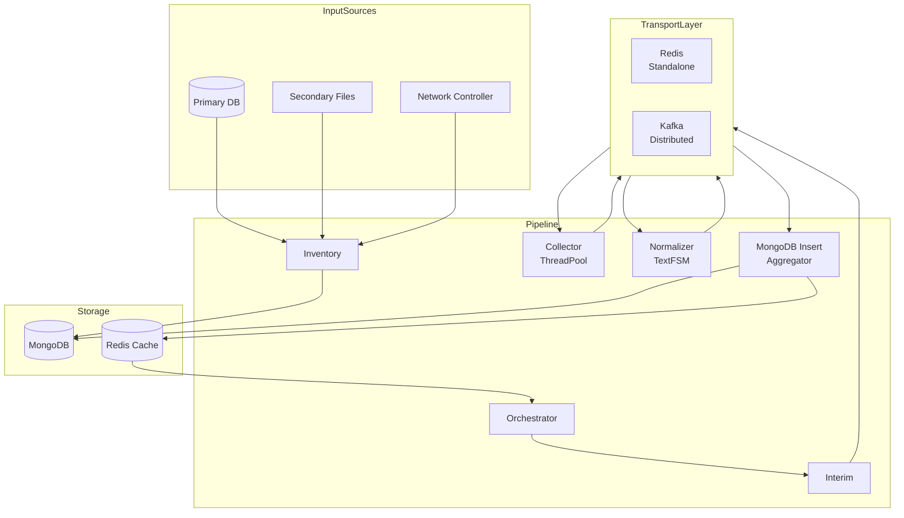

# NetFleet

> Production grade distributed platform for managing
> large scale network device fleets

[](https://python.org)
[](https://fastapi.tiangolo.com)
[](https://mongodb.com)
[](https://redis.io)
[](https://kafka.apache.org)
[](https://kubernetes.io)
[](LICENSE)

---

## Why NetFleet

Every network team faces the same problem.

Millions of devices. Multiple vendors. Different
protocols. Jobs running at odd hours. Devices going
unreachable. No visibility into what succeeded and
what failed.

Existing tools either do not scale or are too
expensive or are locked to one vendor.

NetFleet is the open source answer — a production
grade distributed platform built on patterns from
real networks managing device fleets at scale.

---

## What Makes NetFleet Different
```
Most tools        NetFleet
─────────────     ────────────────────────────
Single vendor  →  6 vendors out of the box
Fixed scale    →  3 deployment profiles
No discovery   →  Cron and event driven
No priority    →  Segment based priority queues
No failure     →  Circuit breakers, retry budgets
Single format  →  TextFSM normalization
Vendor lock    →  Plugin architecture
No metrics     →  Prometheus and Grafana built in
```

---

## Deployment Profiles

Pick the profile that matches your scale.
Same codebase. One environment variable switches
the transport layer.

### Standalone — up in 5 minutes
For teams managing up to 100K devices.
Docker Compose. Redis queues. Cron discovery.
```bash
cp .env.example .env
docker-compose -f deploy/standalone/docker-compose.yml up
```

### Distributed — scales to millions
For large deployments with Kafka and Kubernetes.
Event driven discovery. Auto scaling workers.
```bash
kubectl apply -f deploy/distributed/k8s/
```

### Enterprise — 10M+ devices
Full cluster setup. Multi tenant. MongoDB cluster.
Redis cluster. Kafka cluster.
```bash
kubectl apply -f deploy/enterprise/k8s/
```

---

## Architecture


Full architecture details → [HLD Document](docs/HLD.md)

---

## Five Component Pipeline

### Component 1 — Inventory
Maintains live fleet inventory across all segments
and regions. Supports cron based batch mode for
standalone deployments and event driven real time
mode for distributed deployments.

Key features:
- Region basis delta validation — prevents silent data loss
- Blue green refresh — atomic all or nothing update
- Dual source support — primary DB and secondary files
- Automatic rollback on failure

### Component 2 — Orchestrator
Monitors all configured jobs and triggers based on
cron schedules. Owns the complete job lifecycle from
PENDING to COMPLETE or FAILED.

Key features:
- Count based completion tracking — no polling
- Timeout safety net — no zombie jobs
- Priority queue isolation per segment
- Complete job audit trail

### Component 3 — Interim
Resolves devices for a given segment and distributes
to priority queues. Higher segments always processed
before lower segments regardless of job order.

### Component 4a — Collector Pool
Connects to network devices concurrently and executes
operations. Uses ThreadPool not AsyncIO because network
device latency is unpredictable — one slow device in an
AsyncIO loop blocks hundreds of others.

Key features:
- Configurable ThreadPool per instance
- Plugin based vendor handlers
- Error threshold circuit breaker
- Smart retry — timeout and auth retried, unreachable skipped

### Component 4b — Normalizer Pool
Normalizes raw device output using TextFSM templates.
Same command returns different format from different
vendors. TextFSM converts all formats to a standard
schema automatically.

### Component 5 — MongoDB Insert
Independent microservice for bulk database writes.
Uses aggregator pattern with Redis cache to track
job completion across batches. Cache timeout detects
silent upstream failures automatically.

---

## Supported Vendors

| Vendor | Segments | Protocols | Operations |
|---|---|---|---|
| Cisco IOS | Tier1, Tier2, Tier3 | SSH, SNMP | Stats, Config push |
| Huawei VRP | Tier1, Tier2, Tier3 | SSH, SNMP, Telnet | Stats, Config push |
| Juniper JunOS | Tier1, Tier3 | SSH, SNMP | Stats, Config push |
| BDCOM | Edge, Field | SSH, Telnet | Stats, OLT operations |
| ZTE ZXROS | Edge, Field | SSH, Telnet | Stats, GPON operations |
| UTStarcom | Edge, Field | SSH, Telnet | Stats, DSL operations |

### Add Your Own Vendor

Implement the base plugin interface and register:
```python
class MyVendorPlugin(BaseVendorPlugin):
    vendor = "my_vendor"
    supported_protocols = ["SSH", "Telnet"]
    supported_operations = ["show_interfaces"]

    def connect(self, device): ...
    def execute(self, operation, params): ...
    def disconnect(self): ...

PluginRegistry.register(MyVendorPlugin)
```

---

## Network Segments

| Segment | Type | Priority | Identity |
|---|---|---|---|
| Tier1 | Core Switch | HIGH | Serial Number |
| Tier2 | Distribution Switch | HIGH | Serial Number |
| Tier3 | Data Center Switch | HIGH | Serial Number |
| Edge | Edge Switch | STANDARD | MAC Address |
| Field | Field Switch | STANDARD | MAC Address |

Higher segments always processed first regardless
of job submission order.

---

## TextFSM Template Library

NetFleet includes a growing library of TextFSM
templates for common network operations across
all supported vendors.
```
templates/textfsm/
    cisco_ios/
        show_interfaces.textfsm
        show_optical_power.textfsm
        show_version.textfsm
        show_ip_route.textfsm
    huawei_vrp/
        display_interface.textfsm
        display_optical_power.textfsm
        display_version.textfsm
    juniper_junos/
        show_interfaces.textfsm
        show_route.textfsm
    bdcom/
        show_interface.textfsm
        show_pon_statistics.textfsm
    zte_zxros/
        show_interface.textfsm
        show_gpon_onu.textfsm
    utstarcom/
        show_interface.textfsm
        show_subscriber.textfsm
        show_dsl_line.textfsm
```

Contributing a template for a new vendor or
operation is the easiest way to contribute
to NetFleet.

---

## Failure Handling

NetFleet is designed to fail gracefully at every level.

| Scenario | Detection | Response |
|---|---|---|
| Device unreachable | Connection error | Skip, no retry |
| Device timeout | Socket timeout | Retry once |
| Auth failure | Auth exception | Retry once |
| Error threshold | Error counter | Circuit breaker |
| Instance crash | Thread pool lost | Others continue |
| Cache timeout | No new records | Job marked FAILED |
| Inventory delta invalid | Region mismatch | Abort, keep existing |

---

## Observability

Every component exposes Prometheus metrics.
Pre-built Grafana dashboard included.
```
netfleet_devices_processed_total
netfleet_job_duration_seconds
netfleet_connection_errors_total
netfleet_queue_depth
netfleet_component_health
netfleet_transport_publish_total
netfleet_transport_consume_total
```

Import `metrics/grafana/netfleet_dashboard.json`
into your Grafana instance for instant visibility.

---

## REST API

NetFleet exposes a full REST API for integration
with external systems. Auto-generated Swagger docs
available at `http://localhost:8000/docs`.
```
POST   /api/v1/jobs/trigger          Trigger a job
GET    /api/v1/jobs/{id}/status      Get job status
GET    /api/v1/jobs                  List all jobs
POST   /api/v1/inventory/sync        Trigger inventory sync
GET    /api/v1/inventory/status      Inventory status
GET    /api/v1/devices               List all devices
GET    /api/v1/devices/{id}          Get device details
GET    /api/v1/health                System health
GET    /api/v1/metrics               Component metrics
```

---

## Project Structure
```
netfleet/
├── shared/                 Shared package
│   ├── config/             Settings, segments, jobs
│   ├── models/             Pydantic models
│   ├── utils/              Redis, MongoDB, Logger
│   └── transport/          Pluggable transport layer
├── components/
│   ├── inventory/          Component 1
│   ├── orchestrator/       Component 2
│   ├── interim/            Component 3
│   ├── collector/          Component 4a
│   ├── normalizer/         Component 4b
│   └── db_insert/          Component 5
├── simulator/              Multi vendor mock devices
├── plugins/                Vendor plugin registry
├── templates/textfsm/      TextFSM template library
├── api/                    REST API layer
├── deploy/
│   ├── standalone/         Docker Compose
│   ├── distributed/        Kubernetes + Kafka
│   └── enterprise/         Full cluster setup
├── metrics/                Prometheus and Grafana
└── docs/
    ├── HLD.md              High level design
    ├── LLD.md              Low level design
    ├── API.md              API documentation
    └── DEPLOYMENT.md       Deployment guide
```

---

## Quick Start

### Prerequisites
- Docker and Docker Compose
- Python 3.10+

### Standalone — Recommended for First Run
```bash
# Clone
git clone https://github.com/jatin-practice/netfleet.git
cd netfleet

# Configure
cp .env.example .env

# Start with mock simulator
docker-compose -f deploy/standalone/docker-compose.yml up

# Swagger docs
open http://localhost:8000/docs
```

### Run Tests
```bash
pip install -e ".[dev]"
pytest tests/
```

### Contributing
```bash
# Install in development mode
pip install -e ".[dev]"

# Run a specific component locally
cd components/orchestrator
python main.py
```

---

## Contributing

Contributions welcome. Three easiest ways to start:

1. Add a TextFSM template for a vendor or operation
2. Add a vendor plugin for an unsupported device
3. Improve documentation or add examples

Please read [HLD](docs/HLD.md) before contributing
to understand the architecture.

---

## Documentation

- [High Level Design](docs/HLD.md)
- [Low Level Design](docs/LLD.md)
- [API Documentation](docs/API.md)
- [Deployment Guide](docs/DEPLOYMENT.md)

---

## License

MIT License — see [LICENSE](LICENSE) for details.

---

> Built on patterns from real production experience
> managing large scale network device fleets.
> Designed to be genuinely useful to the network
> engineering community.
