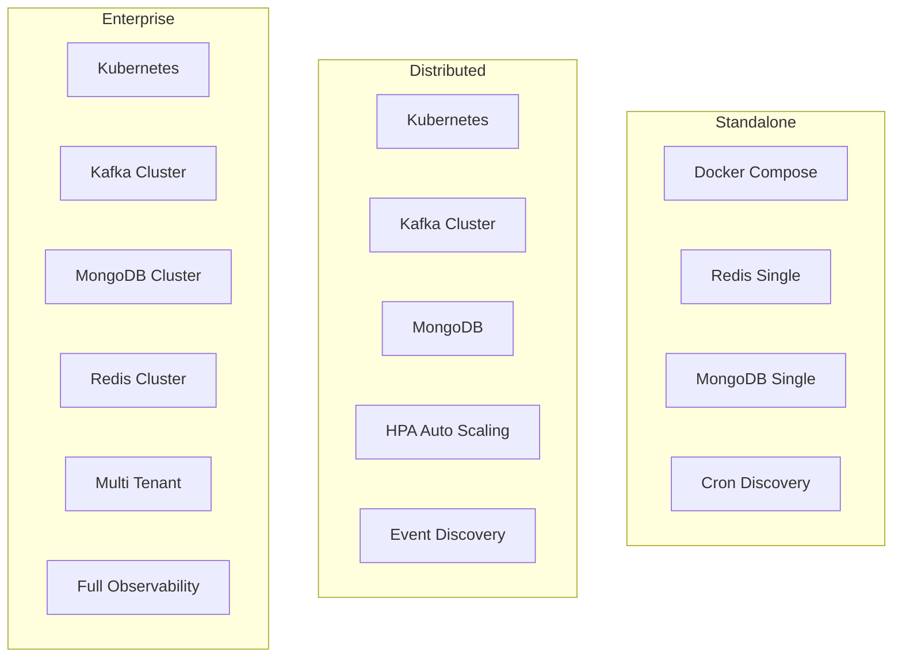

# NetFleet — High Level Design

## Problem Statement

Managing large scale network device fleets is hard.
Most solutions either do not scale or do not handle
failure gracefully.

When you have millions of devices spread across
multiple regions and segments you need a platform that:

- Automatically discovers devices as they join or leave
- Schedules configuration jobs across specific segments
- Connects to hundreds of devices concurrently
- Handles failures without losing the entire job
- Normalizes output across vendors and protocols
- Scales elastically based on workload

Without such a platform:
- Operations teams manually push configs device by device
- No visibility into which devices succeeded or failed
- A single device timeout blocks entire operations
- No audit trail of what changed and when
- No way to scale beyond a few thousand devices

---

## Market Gap
```
Ansible Network    → Good for small fleets
                     Sequential — too slow at scale
                     No built in fleet discovery

Cisco NSO          → Enterprise grade but expensive
                     Vendor specific
                     Not open source

Netmiko + Scripts  → What most engineers use today
                     Manual, not scalable
                     No failure handling

Nothing in open    → Handles millions of devices
source today         Multi vendor
                     Intelligent failure handling
                     Built in security
                     Real time observability
```

NetFleet fills this gap.

---

## System Overview

NetFleet is a distributed network automation platform
built on a five component pipeline. It supports three
deployment profiles to match any scale requirement.
```
Deployment Profiles:

Standalone   → Docker Compose, Redis queues
               Cron based discovery
               Up to 100K devices
               Single instance per component

Distributed  → Kubernetes, Kafka event bus
               Event driven discovery
               Auto scaling workers
               100K to 10M devices

Enterprise   → Kubernetes cluster
               Kafka cluster, MongoDB cluster
               Redis cluster, multi tenant
               10M+ devices
```

### Users
- Network Operations — schedule and monitor jobs
- Network Architects — configure segments and protocols
- Security Teams — credential lifecycle management
- DevOps Teams — observability and alerting

---

## Architecture

### Core Pipeline
```mermaid
graph TB
    subgraph Input Sources
        PDB[(Primary DB\nHigher Segments)]
        SF[Secondary Files\nRegion Basis]
        NC[Network Controller\nEvent Driven]
    end

    subgraph NetFleet Pipeline
        D[Component 1\nDevice Discovery]
        S[Component 2\nJob Scheduler]
        I[Component 3\nInterim Orchestrator]
        P[Component 4a\nPreprocessor Pool\nThreadPool]
        PP[Component 4b\nPostprocessor Pool\nTextFSM]
        M[Component 5\nMongoDB Insert\nAggregator]
    end

    subgraph Transport Layer — pluggable
        RQ[Redis Queues\nStandalone Mode]
        KQ[Kafka Topics\nDistributed Mode]
    end

    subgraph Storage
        DB[(MongoDB)]
        RC[(Redis Cache\nJob Progress)]
    end

    subgraph Devices
        C[Cisco IOS\nTier1 Tier2 Tier3]
        H[Huawei VRP\nTier1 Tier2 Tier3]
        J[Juniper JunOS\nISP Core]
        B[BDCOM\nEdge Field]
        Z[ZTE ZXROS\nEdge Field]
        U[UTStarcom\nEdge Field]
    end

    PDB --> D
    SF --> D
    NC --> D
    D --> DB
    S --> I
    I --> Transport Layer — pluggable
    Transport Layer — pluggable --> P
    P --> C
    P --> H
    P --> J
    P --> B
    P --> Z
    P --> U
    C --> P
    H --> P
    J --> P
    B --> P
    Z --> P
    U --> P
    P --> Transport Layer — pluggable
    Transport Layer — pluggable --> PP
    PP --> Transport Layer — pluggable
    Transport Layer — pluggable --> M
    M --> DB
    M --> RC
    RC --> S
```

---

### Hybrid Transport Architecture
```mermaid
graph LR
    subgraph Standalone Profile
        R[Redis Lists\nDocker Compose\nUp to 100K devices]
    end

    subgraph Distributed Profile
        K[Kafka Topics\nKubernetes\n100K to 10M devices]
    end

    subgraph Business Logic — unchanged
        BL[All Components\nSame code\nDifferent transport]
    end

    ENV[TRANSPORT_MODE\nenv variable] --> BL
    BL --> R
    BL --> K
```

One environment variable switches the entire
transport layer. Business logic never changes.

---

### Deployment Profiles


---

## Network Segments

| Segment | Type | Priority | Identity | Vendors |
|---|---|---|---|---|
| Tier1 | Core Switch | HIGH | Serial Number | Cisco, Huawei, Juniper |
| Tier2 | Distribution Switch | HIGH | Serial Number | Cisco, Huawei |
| Tier3 | Data Center Switch | HIGH | Serial Number | Cisco, Huawei, Juniper |
| Edge | Edge Switch | STANDARD | MAC Address | BDCOM, ZTE, UTStarcom |
| Field | Field Switch | STANDARD | MAC Address | BDCOM, UTStarcom |

---

## Component Responsibilities

### Component 1 — Device Discovery

Maintains live fleet inventory across all segments
and regions.

**Two modes — pluggable:**
```
Cron Mode — Standalone:
    Runs daily in idle hours
    Queries primary DB for higher segments
    Reads secondary files for lower segments
    Region basis delta validation
    Blue green refresh pattern

Event Driven Mode — Distributed:
    Listens to network controller events
    Device joins → discovered immediately
    Device leaves → marked inactive immediately
    Real time fleet accuracy
    No stale data
```

**Region basis delta validation:**
```
For each region:
    existing_count = current DB count
    incoming_count = new data count
    delta_pct = abs(existing - incoming) / existing * 100

    if delta_pct <= threshold:
        region VALID
    else:
        region INVALID — abort, keep existing data
```

Prevents silent data loss when secondary files
are partially copied or primary DB is unavailable.

**Blue Green Refresh:**
```
Validate all regions
    → Backup current DB
    → Truncate
    → Bulk insert new data
    → Verify counts
    → Done
    → Rollback to backup if insert fails
```

---

### Component 2 — Job Scheduler

Monitors all configured jobs and triggers based
on cron schedules. Owns job lifecycle.

**Job lifecycle:**
```
PENDING → RUNNING → COMPLETE
                  → FAILED
                  → TIMEOUT
```

**Count based completion tracking:**
```
At trigger:
    store total_records = device count for segment

During execution:
    MongoDB Insert reports inserted_records
    via Redis cache

Completion check:
    if inserted_records >= total_records:
        mark job COMPLETE
```

**Timeout safety net:**

If job does not complete within timeout window —
mark FAILED. Prevents zombie jobs.

---

### Component 3 — Interim Orchestrator

Resolves devices for given segment and distributes
to priority queues via transport layer.

**Priority isolation:**
```
Tier1, Tier2, Tier3 → HIGH priority topic/queue
Edge, Field         → STANDARD priority topic/queue
```

Critical operations never blocked by high volume
lower segment jobs.

---

### Component 4a — Preprocessor Pool

Connects to devices and executes operations.
Performance heart of the system.

**Why ThreadPool not AsyncIO:**
```
Network devices have unpredictable latency:
    Fast device   → 200ms response
    Slow device   → 30000ms response
    Overloaded    → timeout

AsyncIO event loop:
    One slow device blocks entire loop
    Cascading failures across hundreds of ops

ThreadPool:
    Each device gets its own thread
    Slow device only blocks itself
    Other threads continue independently
    Predictable, isolated, battle tested
```

**Plugin based vendor support:**
```python
handler = PluginRegistry.get_handler(
    vendor=device.vendor,
    protocol=device.protocol
)
handler.connect(device)
result = handler.execute(operation)
```

Supports: Cisco IOS, Huawei VRP, Juniper JunOS,
BDCOM, ZTE ZXROS, UTStarcom.

Community can add any vendor via plugin interface.

**Error threshold circuit breaker:**
```
connection_errors >= ERROR_THRESHOLD:
    component marks itself FAILED
    signals Scheduler immediately
```

**Retry logic:**
```
Timeout      → retry — transient issue
Auth failure → retry — timing issue
Unreachable  → no retry — device is down
```

---

### Component 4b — Postprocessor Pool

Normalizes raw device output using TextFSM templates.

**Why TextFSM:**
```
Same command, different vendor output:

Cisco show interfaces:
    GigabitEthernet0/0 is up, line protocol is up
    Hardware is iGbE, address is aabb.ccdd.eeff

Huawei display interface:
    GigabitEthernet0/0/0 current state: UP
    Hardware address is AABB-CCDD-EEFF

TextFSM template converts both to:
    {
        "interface": "GigabitEthernet0/0",
        "status": "up",
        "mac_address": "aa:bb:cc:dd:ee:ff"
    }
```

Template library covers all supported vendors
and common operations. Community can contribute
templates for any vendor.

---

### Component 5 — MongoDB Insert

Independent microservice for bulk database writes.
Originally part of Postprocessor — separated for
independent scaling and clean failure isolation.

**Aggregator pattern:**
```
Records arrive in batches — not all at once

Cache per job:
    cache[execution_id] = {
        total_records: N,
        inserted_records: 0,
        last_updated: timestamp
    }

Each batch:
    inserted_records += batch_size
    update cache
    if inserted >= total:
        signal Scheduler COMPLETE

Cache timeout:
    No new records within window
    Signal Scheduler FAILED
    Silent upstream failure detected
```

---

## Plugin Architecture

Any vendor can be supported by implementing
the base plugin interface:
```python
class BaseVendorPlugin:
    vendor: str
    supported_protocols: list[str]
    supported_operations: list[str]
    textfsm_templates_path: str

    def connect(self, device: Device): pass
    def execute(self, operation: str,
                params: dict) -> str: pass
    def disconnect(self): pass
    def health_check(self) -> bool: pass

# Register plugin
PluginRegistry.register(CiscoIOSPlugin)
```

**Currently supported vendors:**

| Vendor | Segment | Protocols | Operations |
|---|---|---|---|
| Cisco IOS | Tier1, Tier2, Tier3 | SSH, SNMP | Stats, Config |
| Huawei VRP | Tier1, Tier2, Tier3 | SSH, SNMP, Telnet | Stats, Config |
| Juniper JunOS | Tier1, Tier3 | SSH, SNMP | Stats, Config |
| BDCOM | Edge, Field | Telnet, SSH | Stats, OLT ops |
| ZTE ZXROS | Edge, Field | Telnet, SSH | Stats, GPON ops |
| UTStarcom | Edge, Field | Telnet, SSH | Stats, DSL ops |

---

## Data Flow

### Happy Path
```
1.  Scheduler detects job cron matches current time
2.  Scheduler calls Interim with job details
3.  Interim queries Discovery DB for segment devices
4.  Interim publishes device records to transport
5.  Scheduler marks job RUNNING, stores total_records
6.  Preprocessor workers consume from transport
7.  Plugin handler connects to device
8.  Raw output published to transport
9.  Postprocessor consumes raw output
10. TextFSM template normalizes vendor output
11. Normalized records published to transport
12. MongoDB Insert consumes normalized records
13. Bulk insert to MongoDB
14. Cache updated with inserted_count
15. Scheduler detects inserted == total → COMPLETE
```

### Failure Paths
```
Device unreachable:
    Skip, no retry, continue to next device

Device timeout or auth failure:
    Retry once, then skip

Component error threshold reached:
    Component → FAILED
    Signal Scheduler
    Scheduler → job FAILED
    Alert raised

Instance crash:
    Thread pool records lost — max 150 per instance
    Other instances absorb remaining work
    Acceptable loss for stats collection

Cache timeout — silent upstream failure:
    MongoDB Insert detects no new records
    Signals Scheduler → job FAILED
```

---

## Key Design Decisions

### 1. Pluggable Transport Layer
Single environment variable switches between Redis
and Kafka. Business logic never changes. Deploy at
any scale without code changes.

### 2. ThreadPool over AsyncIO
Network device latency is unpredictable and highly
variable. AsyncIO event loop blocked by one slow
device cascades failures. ThreadPool isolates each
connection completely.

### 3. Plugin Based Vendor Support
Hardcoded vendor support limits community adoption.
Plugin interface lets anyone add any vendor.
Community grows the platform.

### 4. Region Basis Delta Validation
Global threshold misses partial file failures.
Region basis catches cases where one region fails
while others succeed. Prevents silent data loss.

### 5. MongoDB as Independent Microservice
Separated from Postprocessor for independent
scaling, clean failure isolation and single
responsibility per component.

### 6. Blue Green Discovery Refresh
Atomic all-or-nothing refresh. No partial state
windows. Instant rollback on failure.

### 7. TextFSM Template Library
Vendor output normalization is solved once in
templates. New vendor support requires only
new templates and a plugin — not code changes.

---

## Failure Handling Summary

| Scenario | Detection | Response |
|---|---|---|
| Device unreachable | Connection error | Skip, no retry |
| Device timeout | Socket timeout | Retry once |
| Auth failure | Auth exception | Retry once |
| Error threshold | Error counter | Component FAILED |
| Instance crash | Thread pool lost | Others continue |
| Cache timeout | No new records | Job FAILED |
| Discovery delta invalid | Region mismatch | Abort, keep existing |
| Transport failure | Connection error | Circuit breaker |

---

## Observability

Every component exposes Prometheus metrics:
```
netfleet_devices_processed_total
netfleet_job_duration_seconds
netfleet_connection_errors_total
netfleet_queue_depth
netfleet_component_health
netfleet_transport_publish_total
netfleet_transport_consume_total
```

Pre-built Grafana dashboard included in
`metrics/grafana/netfleet_dashboard.json`.

---

## Technology Stack

| Layer | Standalone | Distributed | Enterprise |
|---|---|---|---|
| Queue | Redis Lists | Kafka Topics | Kafka Cluster |
| Cache | Redis | Redis | Redis Cluster |
| Database | MongoDB | MongoDB | MongoDB Cluster |
| Deployment | Docker Compose | Kubernetes | Kubernetes |
| Discovery | Cron | Event Driven | Event Driven |
| Scaling | Manual | HPA Auto | HPA Auto |

**Common across all profiles:**

| Component | Technology | Reason |
|---|---|---|
| API | FastAPI | Async, Pydantic, auto Swagger |
| Concurrency | ThreadPool | Device latency variance |
| Normalization | TextFSM | Industry standard |
| Protocols | Netmiko | Battle tested network I/O |
| Monitoring | Prometheus + Grafana | Industry standard |

---

## Future Roadmap

- Anomaly detection on collected stats
- Predictive alerting before device failure
- RESTCONF and YANG model support
- Web based job management dashboard
- Dead letter queue for failed operations
- Distributed tracing with OpenTelemetry
- Support for gNMI streaming telemetry
