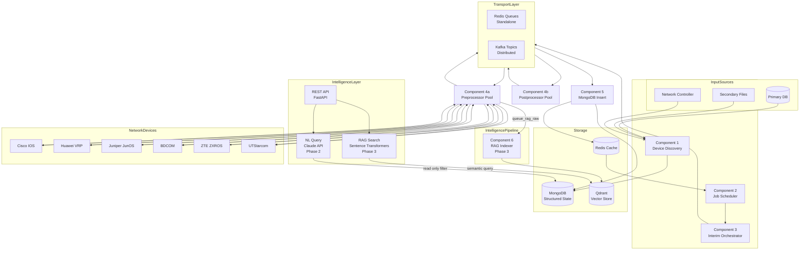
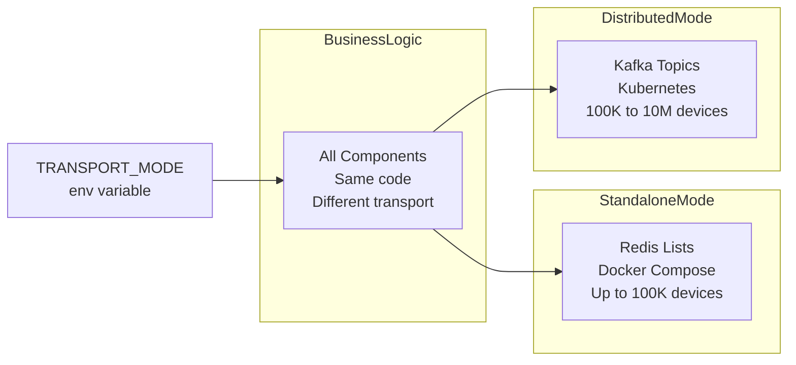
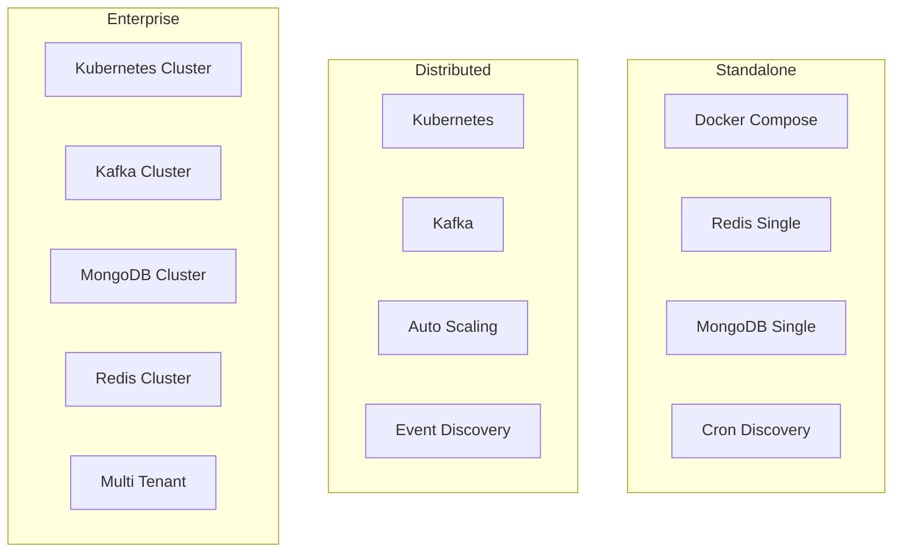

# NetFleet — High Level Design

## Problem Statement

Managing large scale network device fleets is hard.
Most solutions either do not scale or do not handle
failure gracefully.

When you have millions of devices spread across
multiple regions and segments you need a platform that:

- Automatically discovers devices as they join or leave
- Schedules configuration jobs across specific segments
- Connects to hundreds of devices concurrently
- Handles failures without losing the entire job
- Normalizes output across vendors and protocols
- Scales elastically based on workload

Without such a platform:
- Operations teams manually push configs device by device
- No visibility into which devices succeeded or failed
- A single device timeout blocks entire operations
- No audit trail of what changed and when
- No way to scale beyond a few thousand devices

---

## Market Gap
```
Ansible Network    → Good for small fleets
                     Sequential — too slow at scale
                     No built in fleet discovery

Cisco NSO          → Enterprise grade but expensive
                     Vendor specific
                     Not open source

Netmiko Scripts    → What most engineers use today
                     Manual, not scalable
                     No failure handling

Open Source Gap    → Nothing handles millions of devices
                     Multi vendor
                     Intelligent failure handling
                     Built in security
                     Real time observability
```

NetFleet fills this gap.

A second gap exists in the intelligence layer. Even
after collecting device data, operations teams query
MongoDB directly using raw query syntax. Raw CLI
output stored as text is unsearchable. These are
the problems Phase 2 and Phase 3 address.

---

## System Overview

NetFleet is a distributed network automation platform
built on a five component pipeline. It supports three
deployment profiles to match any scale requirement.
```
Standalone   → Docker Compose, Redis queues
               Cron based discovery
               Up to 100K devices

Distributed  → Kubernetes, Kafka event bus
               Event driven discovery
               Auto scaling workers
               100K to 10M devices

Enterprise   → Kubernetes cluster
               Kafka cluster, MongoDB cluster
               Redis cluster, multi tenant
               10M+ devices
```

Two intelligence phases layer on top of the pipeline:
```
Phase 2      → Natural Language Query
               Claude API translates plain English
               to MongoDB filter and executes it
               POST /api/v1/query

Phase 3      → RAG on Device Output
               Raw CLI output embedded and stored
               in Qdrant vector store
               Semantic search over device logs
               POST /api/v1/search
```

---

## Architecture

### Core Pipeline


---

### Hybrid Transport Architecture


One environment variable switches the entire
transport layer. Business logic never changes.

---

### Deployment Profiles


---

## Network Segments

| Segment | Type | Priority | Identity | Vendors |
|---|---|---|---|---|
| Tier1 | Core Switch | HIGH | Serial Number | Cisco, Huawei, Juniper |
| Tier2 | Distribution Switch | HIGH | Serial Number | Cisco, Huawei |
| Tier3 | Data Center Switch | HIGH | Serial Number | Cisco, Huawei, Juniper |
| Edge | Edge Switch | STANDARD | MAC Address | BDCOM, ZTE, UTStarcom |
| Field | Field Switch | STANDARD | MAC Address | BDCOM, UTStarcom |

---

## Component Responsibilities

### Component 1 — Device Discovery

Maintains live fleet inventory across all segments
and regions.

**Two modes:**
```
Cron Mode — Standalone:
    Runs daily in idle hours
    Queries primary DB for higher segments (Tier1/2/3)
    Reads secondary files for lower segments (Edge/Field)
    Per-(region, segment) delta validation
    Blue green refresh — atomic per city

Event Driven Mode — Distributed:
    Listens to network controller events via Kafka
    Device joins network — upsert as ACTIVE immediately
    Device leaves network — marked INACTIVE
    IP change events — ip_address updated in place
    Real time fleet accuracy with no bulk refresh
```

**Manual trigger:**
```
API: POST /api/v1/discovery/sync
    → pushes to queue_discovery_trigger (Redis)
    → discovery component trigger listener picks up
    → runs full cycle (or subset if segments/regions specified)
    → returns immediately, discovery is async
```

**Source routing:**
```
Higher segments (Tier1, Tier2, Tier3):
    Source: primary_db
    Adapter: BasePrimaryDBAdapter (configurable)
    Default: MockPrimaryDBAdapter for dev / simulator

Lower segments (Edge, Field):
    Source: secondary_files
    File naming: {region}_{segment}.json or .csv
    e.g. mumbai_Edge.json, delhi_Field.csv
```

**Region basis delta validation:**
```
Granularity: per (region, segment) pair.
One region = one city. One city can have 200K–2M devices.
Diffing individual devices at this scale is prohibitive.
Count comparison is O(1) with a MongoDB compound index.

For each (region, segment):
    existing_count = MongoDB count for that city + segment
    incoming_count = count in new data batch
    delta_pct = abs(incoming - existing) / existing * 100

    existing_count == 0   → first run, always VALID
    delta_pct <= threshold → VALID  — proceed with full replace
    delta_pct >  threshold → INVALID — abort, keep existing data

Each (region, segment) is evaluated independently.
One city failing does not block other cities.
```

Prevents silent data loss when secondary files
are partially copied or primary DB is unavailable.
The 10% default threshold allows organic fleet churn
(new devices added, decommissions) while catching
bulk data loss scenarios.

**Blue Green Refresh:**
```
Per each VALID (region, segment):
    1. Backup   existing devices for this city+segment
                → discovery_backup collection
    2. Delete   existing devices for this city+segment
                from devices collection
    3. Insert   new devices in bulk
    4. Verify   actual count == incoming_count
    5. Rollback if verify fails
                → delete partial insert
                → restore from backup

Cities are refreshed independently in sequence.
A failed rollback is logged but does not halt
processing of remaining cities.
```

---

### Component 2 — Job Scheduler

Monitors all configured jobs and triggers based
on cron schedules. Owns the job lifecycle.

**Job lifecycle:**
```
PENDING → RUNNING → COMPLETE
                  → FAILED
                  → TIMEOUT
```

**Count based completion tracking:**
```
At trigger:
    store total_records = device count for segment

During execution:
    MongoDB Insert reports inserted_records
    via Redis cache

Completion:
    if inserted_records >= total_records:
        mark job COMPLETE
```

**Timeout safety net:**

If job does not complete within timeout window
mark FAILED. Prevents zombie jobs running forever.

---

### Component 3 — Interim Orchestrator

Resolves devices for given segment from Discovery DB
and distributes to priority queues via transport.

**Priority isolation:**
```
Tier1, Tier2, Tier3 → HIGH priority queue
Edge, Field         → STANDARD priority queue
```

Critical operations never blocked by high volume
lower segment jobs.

---

### Component 4a — Preprocessor Pool

Connects to devices and executes operations.
Performance heart of the system.

**Why ThreadPool not AsyncIO:**
```
Network devices have unpredictable latency:
    Fast device   → 200ms response
    Slow device   → 30000ms response

AsyncIO event loop:
    One slow device blocks entire loop
    Cascading failures

ThreadPool:
    Each device gets its own thread
    Slow device only blocks itself
    Predictable and isolated
```

**Plugin based vendor support:**
```python
handler = PluginRegistry.get_handler(
    vendor=device.vendor,
    protocol=device.protocol
)
result = handler.execute(operation)
```

**Error threshold circuit breaker:**
```
connection_errors >= ERROR_THRESHOLD:
    component marks itself FAILED
    signals Scheduler immediately
```

**Retry logic:**
```
Timeout      → retry once
Auth failure → retry once
Unreachable  → no retry
```

---

### Component 4b — Postprocessor Pool

Normalizes raw device output using TextFSM templates.

**Why TextFSM:**
```
Same command — different vendor output:

Cisco:
    GigabitEthernet0/0 is up, line protocol is up
    Hardware address is aabb.ccdd.eeff

Huawei:
    GigabitEthernet0/0/0 current state: UP
    Hardware address is AABB-CCDD-EEFF

TextFSM normalizes both to:
    {
        "interface": "GigabitEthernet0/0",
        "status": "up",
        "mac_address": "aa:bb:cc:dd:ee:ff"
    }
```

Template library covers all supported vendors.
Community can contribute templates for any vendor.

---

### Component 5 — MongoDB Insert

Independent microservice for bulk database writes.
Separated from Postprocessor for independent
scaling and clean failure isolation.

**Aggregator pattern with Redis cache:**
```
Records arrive in batches

Cache per job:
    {
        total_records: N,
        inserted_records: 0,
        last_updated: timestamp
    }

Each batch:
    inserted_records += batch_size
    if inserted >= total:
        signal Scheduler COMPLETE

Cache timeout:
    No new records within window
    Signal Scheduler FAILED
```

---

### Component 6 — RAG Indexer (Phase 3)

Consumes raw device CLI output from a dedicated
fanout queue and builds a searchable vector corpus
in Qdrant. Runs independently of the core pipeline.

**Fanout from Preprocessor:**
```
Preprocessor publishes raw output to two queues:

    queue_raw_results   → Postprocessor (existing)
    queue_rag_raw       → RAG Indexer (new)

Both queues carry the same RawDeviceOutput message.
If RAG Indexer is down, queue_rag_raw accumulates.
Core pipeline is completely unaffected.
```

**Chunking and embedding:**
```
Raw CLI output can be thousands of lines.
One vector per device output would lose precision.

Strategy:
    Split raw_output into chunks of ~512 tokens
    Each chunk becomes one Qdrant point
    Chunk carries full device metadata as payload

Embedding model:
    sentence-transformers all-MiniLM-L6-v2
    384 dimensional dense vector
    Runs locally — no external API call
```

**Qdrant point payload:**
```
{
    device_id:    string,
    vendor:       string,
    region:       string,
    segment:      string,
    operation:    string,
    execution_id: string,
    collected_at: ISO8601 timestamp,
    raw_chunk:    string (512 token window)
}
```

**Why Qdrant and not MongoDB Atlas Vector Search:**
```
MongoDB holds structured fleet state.
Mixing vector index into the same DB couples
the operational store with the search corpus.
Qdrant is purpose built for vector workloads
and keeps the two concerns separated.
```

---

### Phase 2 — Natural Language Query Engine

Allows ops engineers to query fleet state and
device statistics using plain English instead of
writing MongoDB filters manually.

**Request flow:**
```
POST /api/v1/query
    body: { "question": "show me all BX devices
                         in bangalore with high
                         CRC errors" }

1. NL Query service receives question
2. Builds schema context from MongoDB collections
   (devices, device_stats, operation_results)
3. Calls Claude claude-sonnet-4-20250514 with
   system prompt containing schema context
4. Claude returns a MongoDB filter JSON object
5. Safety validator checks filter is read-only:
   rejects $where, $eval, $function operators
6. Motor executes filter against target collection
7. Results formatted to plain English summary
8. Response returned to caller
```

**Schema context injection (system prompt excerpt):**
```
You convert natural language questions about a
network device fleet into MongoDB filter objects.

Collection: devices
Fields:
  device_id (string), ip_address (string),
  vendor (enum: cisco_ios huawei_vrp juniper_junos
               bdcom zte_zxros utstarcom),
  segment (enum: Tier1 Tier2 Tier3 Edge Field),
  region (string), status (enum: ACTIVE INACTIVE
  UNREACHABLE), protocol (enum: SSH SNMP TELNET REST)

Collection: device_stats
Fields:
  device_id (string), operation (string),
  region (string), segment (string),
  stats (object with vendor-specific fields
         e.g. crc_errors, cpu_percent, rx_power_dbm),
  collected_at (datetime), execution_id (string)

Return ONLY valid JSON. No explanation.
Example: { "region": "bangalore",
           "stats.crc_errors": { "$gt": 100 } }
```

**What Claude does not decide:**
```
Claude only produces the filter dict.
Collection routing (devices vs device_stats)
is decided by keyword matching in the question
before the Claude call — not by Claude.
This prevents prompt injection from redirecting
queries to unintended collections.
```

---

## Plugin Architecture

Anyone can add vendor support by implementing
the base plugin interface:
```python
class BaseVendorPlugin:
    vendor: str
    supported_protocols: list[str]
    supported_operations: list[str]
    textfsm_templates_path: str

    def connect(self, device: Device): pass
    def execute(self, operation: str,
                params: dict) -> str: pass
    def disconnect(self): pass
    def health_check(self) -> bool: pass

# Register
PluginRegistry.register(CiscoIOSPlugin)
```

**Supported vendors:**

| Vendor | Segments | Protocols |
|---|---|---|
| Cisco IOS | Tier1, Tier2, Tier3 | SSH, SNMP |
| Huawei VRP | Tier1, Tier2, Tier3 | SSH, SNMP, Telnet |
| Juniper JunOS | Tier1, Tier3 | SSH, SNMP |
| BDCOM | Edge, Field | Telnet, SSH |
| ZTE ZXROS | Edge, Field | Telnet, SSH |
| UTStarcom | Edge, Field | Telnet, SSH |

---

## Data Flow

### Happy Path — Core Pipeline
```
1.  Scheduler detects job cron matches current time
2.  Scheduler calls Interim with job details
3.  Interim queries Discovery DB for segment devices
4.  Interim publishes device records to transport
5.  Scheduler marks job RUNNING stores total_records
6.  Preprocessor workers consume from transport
7.  Plugin handler connects to device
8.  Raw output published to queue_raw_results
9.  Raw output also published to queue_rag_raw
10. Postprocessor consumes queue_raw_results
11. TextFSM template normalizes vendor output
12. Normalized records published to transport
13. MongoDB Insert consumes normalized records
14. Bulk insert to MongoDB
15. Cache updated with inserted count
16. Scheduler detects inserted equals total
17. Job marked COMPLETE
```

### Happy Path — Phase 3 (RAG Indexing, runs in parallel)
```
9.  RAG Indexer consumes from queue_rag_raw
10. Raw CLI output split into 512 token chunks
11. Sentence transformer generates 384-dim vector
    per chunk
12. Qdrant upsert: vector + device metadata payload
13. Point available for semantic search immediately
```

### Happy Path — Phase 2 (NL Query, on demand)
```
1.  Client sends POST /api/v1/query with question
2.  NL Query service detects target collection
    from question keywords
3.  MongoDB schema context built for that collection
4.  Claude API called with system prompt + question
5.  Claude returns MongoDB filter JSON
6.  Safety validator rejects forbidden operators
7.  Motor executes read-only find with filter
8.  Up to 50 matching documents returned
9.  Results serialized to plain English summary
10. Response sent to client
```

### Happy Path — Phase 3 (RAG Search, on demand)
```
1.  Client sends POST /api/v1/search with question
2.  Sentence transformer embeds question to vector
3.  Qdrant nearest-neighbour search with top_k=10
4.  Results ranked by cosine similarity score
5.  Raw chunks + device metadata returned to client
```

### Failure Paths
```
Device unreachable:
    Skip, no retry, continue

Device timeout or auth failure:
    Retry once, then skip

Component error threshold reached:
    Component FAILED
    Signal Scheduler
    Job FAILED
    Alert raised

Instance crash:
    Thread pool records lost
    Other instances absorb remaining work

Cache timeout:
    MongoDB Insert detects silence
    Signals Scheduler
    Job FAILED
```

---

## Key Design Decisions

### 1. Pluggable Transport Layer
Single environment variable switches between Redis
and Kafka. Business logic never changes. Same code
deploys at any scale.

### 2. ThreadPool over AsyncIO
Network device latency is unpredictable. AsyncIO
blocked by one slow device cascades failures.
ThreadPool isolates each connection completely.

### 3. Plugin Based Vendor Support
Hardcoded vendor support limits adoption. Plugin
interface lets anyone add any vendor. Community
grows the platform organically.

### 4. Region Basis Delta Validation
Global threshold misses partial file failures.
Region basis catches cases where one region fails
while others succeed.

### 5. MongoDB as Independent Microservice
Separated from Postprocessor for independent
scaling and single responsibility per component.

### 6. Blue Green Discovery Refresh
Atomic all-or-nothing refresh. No partial state.
Instant rollback on failure.

### 7. TextFSM Template Library
Vendor normalization solved once in templates.
New vendor requires only new templates and plugin.
No code changes needed.

### 8. Fanout Queue for RAG (Phase 3)
Preprocessor publishes raw output to a dedicated
queue_rag_raw alongside the existing queue_raw_results.
RAG Indexer consumes only from queue_rag_raw.
This keeps the RAG pipeline entirely decoupled —
a failed or slow RAG Indexer cannot stall the core
pipeline. Queue depth grows in Redis until the
indexer catches up.

### 9. Claude Handles Only Filter Generation (Phase 2)
Claude receives schema context and returns a filter
dict. Collection routing and query execution happen
in application code. This isolates the LLM from
making structural decisions and limits the blast
radius of any prompt injection attempt.

### 10. Local Embedding Model (Phase 3)
sentence-transformers runs in-process inside the
RAG Indexer and API container. No embedding API call,
no external latency, no token cost per search.
The 80MB model loads once at startup.

---

## Failure Handling Summary

| Scenario | Detection | Response |
|---|---|---|
| Device unreachable | Connection error | Skip no retry |
| Device timeout | Socket timeout | Retry once |
| Auth failure | Auth exception | Retry once |
| Error threshold | Error counter | Component FAILED |
| Instance crash | Thread pool lost | Others continue |
| Cache timeout | No new records | Job FAILED |
| Discovery delta invalid | Region mismatch | Abort keep existing |
| Transport failure | Connection error | Circuit breaker |
| RAG Indexer down | queue_rag_raw grows | Core pipeline unaffected, indexer catches up on restart |
| Claude API error | HTTP 5xx or timeout | Return 503 with human readable message, no silent fail |
| Claude returns invalid filter | JSON parse error | Retry once with stricter prompt, then 422 to caller |
| Forbidden operator in filter | Safety validator | Reject with 400, log attempt |
| Qdrant unreachable | Connection error | Search returns 503, indexer retries with backoff |

---

## Observability

Every component exposes Prometheus metrics:
```
netfleet_devices_processed_total
netfleet_job_duration_seconds
netfleet_connection_errors_total
netfleet_queue_depth
netfleet_component_health
netfleet_transport_publish_total
netfleet_transport_consume_total
```

Pre-built Grafana dashboard included in
`metrics/grafana/netfleet_dashboard.json`

---

## Technology Stack

| Layer | Standalone | Distributed | Enterprise |
|---|---|---|---|
| Queue | Redis Lists | Kafka Topics | Kafka Cluster |
| Cache | Redis | Redis | Redis Cluster |
| Database | MongoDB | MongoDB | MongoDB Cluster |
| Deployment | Docker Compose | Kubernetes | Kubernetes |
| Discovery | Cron | Event Driven | Event Driven |
| Scaling | Manual | HPA Auto | HPA Auto |

**Common across all profiles:**

| Component | Technology | Reason |
|---|---|---|
| API | FastAPI | Async, Pydantic, auto Swagger |
| Concurrency | ThreadPool | Device latency variance |
| Normalization | TextFSM | Industry standard |
| Protocols | Netmiko | Battle tested network IO |
| Monitoring | Prometheus and Grafana | Industry standard |

**Intelligence layer (Phase 2 and Phase 3):**

| Component | Technology | Reason |
|---|---|---|
| NL Query (Phase 2) | Claude claude-sonnet-4-20250514 | Best in class instruction following for structured output |
| Vector Store (Phase 3) | Qdrant | Purpose built vector DB, payload filtering, no managed service required |
| Embedding Model (Phase 3) | sentence-transformers all-MiniLM-L6-v2 | Local inference, 384-dim, strong on technical text, 80MB |

---

## Future Roadmap

- RESTCONF and YANG model support
- Web based job management dashboard
- Dead letter queue for failed operations
- Distributed tracing with OpenTelemetry
- Support for gNMI streaming telemetry
- Phase 2 extension: multi turn conversation memory for NL query sessions
- Phase 3 extension: anomaly detection by comparing current embeddings to historical baseline vectors
- Phase 3 extension: auto-alerting when semantic similarity to known failure patterns exceeds threshold
